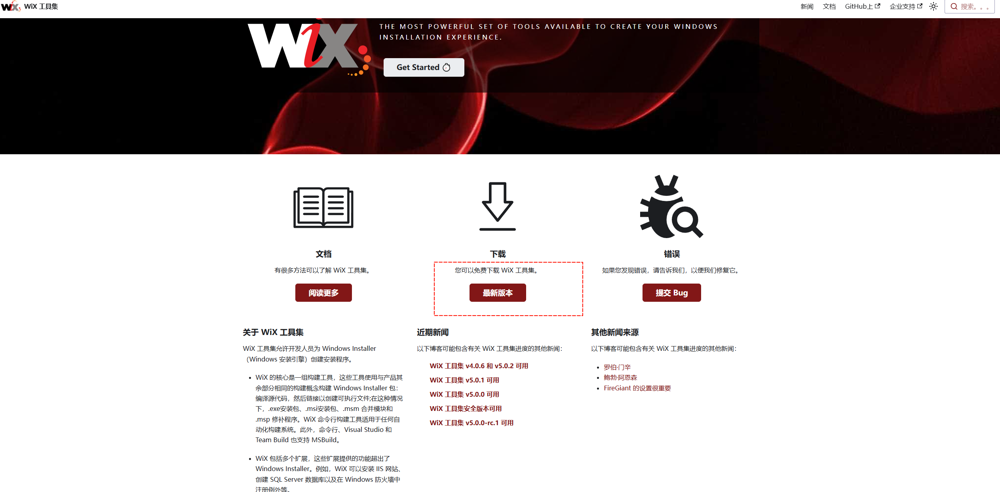

# jfx-maven-plugin

<p align="center">
  <a href="https://github.com/lxwise/jfx-maven-plugin/">
    
  </a>
</p>

<p align="center">
jfx-maven-plugin是一个javafx打包插件,提供了一个一体化的方案来解决基于JavaFX框架打包为独立桌面应用程序的应用程序老大难的问题。支持模块化和非模块化。支持一键打包全平台（windows, Mac, Linux）可执行文件（app-image, exe, msi, rpm, deb, pkg, dmg）的 maven插件。
</p>

<p align="center">
   <a target="_blank" href="https://github.com/lxwise/fx-updater">
      
      
      
      
   </a>
</p>

## 项目地址

**Gitee 地址：** [https://gitee.com/lxwise/jfx-maven-plugin](https://gitee.com/lxwise/jfx-maven-plugin)

**Github 地址：** [https://github.com/lxwise/jfx-maven-plugin](https://github.com/lxwise/jfx-maven-plugin)


## Star

ps: 虽然我知道，大部分人和作者菌一样喜欢白嫖，都是看了直接下载源代码后就潇洒的离开。但我还是想请各位喜欢本项目的小伙伴：**Star**，**Star**，**Star**。只有你们的**Star**本项目才能有更多的人看到，才有更多志同道合的小伙伴一起加入完善本项目。请小伙伴们动动您可爱的小手，给本项目一个**Star**。**同时也欢迎大家提交pr，一起改进项目** 。


## 重要说明

**打包为.exe、.msi安装程序文件是需安装[ WiX 工具集](https://wixtoolset.org/)（`candle` 和 `light` 命令必须在 PATH 变量中）**




### 开始使用 WiX

有三种使用 WiX 的方法：

- [命令行 .NET 工具](https://wixtoolset.org/docs/intro/#nettool)
- [命令行和 CI/CD 生成系统上的 MSBuild](https://wixtoolset.org/docs/intro/#msbuild)
- [Visual Studio的](https://wixtoolset.org/docs/intro/#vs)

### 命令行 .NET 工具[](https://wixtoolset.org/docs/intro/#nettool)

WiX 可作为 [.NET 工具](https://learn.microsoft.com/en-us/dotnet/core/tools/global-tools)使用，供您在命令行中使用。

注意

`wix.exe` 工具需要 .NET SDK 版本 6 或更高版本。

Wix.exe 支持执行特定操作的命令。例如，`build` 命令允许您构建 MSI 包、捆绑包和其他包类型。

要安装 Wix.exe .NET 工具，请执行以下操作：

```sh
dotnet tool install --global wix
```


要验证 Wix.exe 是否已成功安装：

```sh
wix --version
```


### 更新 WiX .NET 工具[](https://wixtoolset.org/docs/intro/#update-the-wix-net-tool)

要更新 WiX 的 [.NET 工具](https://learn.microsoft.com/en-us/dotnet/core/tools/global-tools)安装：

```sh
dotnet tool update --global wix
```


首次将 WiX 安装为 .NET 工具：

```sh
dotnet tool install --global wix
```


要验证 Wix.exe 已成功安装或更新：

```sh
wix --version
```


### 另请参阅[](https://wixtoolset.org/docs/intro/#see-also)

- [Wix.exe 命令行参考](https://wixtoolset.org/docs/tools/wixexe/)


## 安装和使用

### 1.依赖安装

- Maven:

```xml
<build>
    <plugins>
        <plugin>
            <groupId>io.github.lxwise</groupId>
            <artifactId>jfx-maven-plugin</artifactId>
            <version>1.0.0</version>
            <configuration>
                <mainClass>your app MainClass</mainClass>
            </configuration>
        </plugin>
    </plugins>
</build>
```

### 2.打包

执行`mvn clean jfx:package`

```shell
mvn clean jfx:package
```

### 3.示例

#### 3.1.1 模块化打包

```xml
    <build>
        <plugins>
            <plugin>
                <groupId>org.openjfx</groupId>
                <artifactId>javafx-maven-plugin</artifactId>
                <version>0.0.8</version>
                <configuration>
                    <mainClass>com.lxwise.plugin.AppStart</mainClass>
                </configuration>
            </plugin>
            <plugin>
                <groupId>io.github.lxwise</groupId>
                <artifactId>jfx-maven-plugin</artifactId>
                <version>1.0.0</version>
                <configuration>
                    <imagePath>${project.build.directory}/image</imagePath>
                    <name>jfx-test</name>
                    <mainClass>com.lxwise.plugin.AppStart</mainClass>
                </configuration>
            </plugin>
        </plugins>
    </build>
```

#### 3.1.2 非模块化打包

```xml
    <build>
        <plugins>
            <plugin>
                <groupId>io.github.lxwise</groupId>
                <artifactId>jfx-maven-plugin</artifactId>
                <version>1.0.0</version>
                <configuration>
                    <name>jfx-test</name>
                    <mainClass>com.lxwise.plugin.AppStart</mainClass>
                    <macPackageIdentifier>jfx-test</macPackageIdentifier>
                    <linuxMenuGroup>System</linuxMenuGroup>
                    <linuxPackageName>jfx-test</linuxPackageName>
                    <linuxShortcut>true</linuxShortcut>
                    <vendor>lxwise</vendor>
                    <appVersion>1.0.0</appVersion>
                    <aboutUrl>https://github.com/lxwise/jfx-maven-plugin</aboutUrl>
                    <copyright>版权@lxwise</copyright>
                    <description>jfx-test的测试描述信息</description>
                    <winDirChooser>true</winDirChooser>
                    <winMenu>true</winMenu>
                    <winShortcut>true</winShortcut>
                    <winPerUserInstall>true</winPerUserInstall>
                    <winShortcutPrompt>true</winShortcutPrompt>
                    <arguments>
                        <arg>jfx-maven-plugin</arg>
                        <arg>V1.0.0</arg>
                    </arguments>
                    <options>
                        <arg>-Xms128m</arg>
                        <arg>-Xmx1024m</arg>
                    </options>
                </configuration>
            </plugin>
        </plugins>
    </build>
```


## 参数说明

>  使用方法基本是对 [官方说明文档](https://docs.oracle.com/en/java/javase/21/docs/specs/man/jpackage.html)的翻译

### 通用选项

- name:  应用程序名称

> 应用程序和/或包的名称,默认值: **${project.name}**

- mainClass:  应用程序主类名(程序入口)

> 要执行的应用程序主类名

- description: 应用程序的描述

> 应用程序的描述

- version: 应用程序版本

> 应用程序和/或包的版本(一般使用三段式版本比如1.0.1),默认值: **${project.version}**

- type:  应用程序类型

>要创建的包的类型
>有效值为:  {"app-image", "exe", "msi", "rpm", "deb", "pkg", "dmg"}
>如果未指定此选项，将创建特定于平台的默认类型。

- icon: 应用程序图标

> 应用程序包的图标路径(绝对路径或相对于${project.basedir})

- vendor:  应用程序供应商/作者

> 应用程序的供应商/作者

- copyright: 应用程序 版权

> 应用程序的版权

- verbose: 启用详细输出

> 启用详细输出 默认值: false

- imagePath: image 路径

> 模块化打包时使用此参数

- options: vm java-options(数组)

> 传递给JVM的选项,例如

```xml
<options>
    <arg>-Xms128m</arg>
    <arg>-Xmx1024m</arg>
</options>
```

- arguments: 参数数组

> 传递给启动器的主类的命令行参数,例如

```xml
<arguments>
    <arg>jfx-maven-plugin</arg>
    <arg>V1.0.0</arg>
</arguments>
```


### Windows平台打包参数（仅在 Windows 上运行时可用）

- winConsole

> 为应用程序创建控制台启动器，应指定需要控制台交互的应用程序,默认值: **false**

- winDirChooser

> 添加一个对话框，使用户能够选择产品安装的目录。默认值: **false**

- winHelpUrl: url

> 用户可以从中获取更多信息或技术支持的 URL

- winMenu

> 请求为此应用程序添加“开始”菜单快捷方式。默认值: **false**

- winMenuGroup

> 此应用程序所在的“开始”菜单组

- winPerUserInstall

> 请求按用户执行安装。默认值: **false**

- winShortcut

> 请求为此应用程序创建桌面快捷方式。默认值: **false**

- winShortcutPrompt

> 添加一个对话框，使用户能够选择是否由安装程序创建快捷方式。默认值: **false**

- winUpdateUrl

> 可用应用程序更新信息的 URL

- winUpgradeUuid: id

> 与此程序包的升级关联的 UUID


### Mac平台打包参数（仅在 macOS 上运行时可用）

- macPackageIdentifier: 标识符

> 唯一标识 macOS 应用程序的标识符
>
> 默认为主类名称。
>
> 只能使用字母数字 （A-Z，a-z，0-9）、连字符 （-） 和句点 （.） 字符。

- macPackageName: 名称

> 应用程序在 Menu Bar 中显示的名称
>
> 这可能与应用程序名称不同。
>
> 此名称的长度必须少于 16 个字符，并且适合在菜单栏和应用程序 Info 窗口中显示。默认为应用程序名称。

- macPackageSigningPrefix: 前缀

> 对应用程序包进行签名时，此值将作为所有需要签名且没有现有包标识符的组件的前缀。

- macSign

> 请求对包或预定义的应用程序映像进行签名。

- macSigningKeychain: 钥匙链名称

> 用于搜索签名身份的密钥链的名称
>
> 如果未指定，则使用标准密钥链。

- macSigningKeyUserName: 名称

> Apple 签名身份中的团队或用户名部分

- macAppStore

> 指示 jpackage 输出适用于 Mac App Store。默认值: **false**

- macEntitlements: 路径

> 包含对捆绑包中的可执行文件和库进行签名时要使用的权利的文件路径

- macAppCategory: 类别

> 用于在应用程序 plist 中构造 LSApplicationCategoryType 的字符串
>
> 默认值为 “utilities”。

### Linux平台打包参数（仅在 Linux 上运行时可用）

- linuxPackageName:包的名称

> Linux 包的名称
>
> 默认为应用程序名称。

- linuxDebMaintainer: 邮件地址

> .deb 捆绑包的维护者

- linuxMenuGroup: 菜单组名称

> 此应用程序所在的菜单组

- linuxShortcut

> 为应用程序创建快捷方式,默认值: **false**

### 用于创建应用程序包的选项

aboutUrl: url
> 应用程序主页的URL

installDir: 路径
> 应用程序安装目录的绝对路径（在macOS或Linux上），或安装目录的相对子路径，如“Program Files”或“AppData”（在Windows上）

resourceDir:资源路径
> 用于覆盖jpackage资源的路径,根据平台不通,读取:${project.basedir/javafx},下的**mac**,**windows**,**linux**文件夹,不需要配置,文件夹存在即可

### 资源目录
通过向此目录添加替换资源，可以覆盖jpackage的图标、模板文件和其他资源。jpackage将在资源目录中按特定名称查找文件。**读取:${project.basedir/javafx},下的**mac**,**windows**,**linux**文件夹**

#### 仅在Linux上运行时考虑的资源目录文件：
{launcher-name}.png
> 应用程序启动器图标,默认资源为JavaApp.png

{launcher-name}.desktop
> 与xdg-desktop-menu命令一起使用的桌面文件,用于已注册文件关联的应用程序启动器和/或具有图标的应用程序启动器 ,默认资源为template.desktop

#### 仅在构建Linux DEB/RPM安装程序时考虑的资源目录文件：
{package-name}-{launcher-name}.service
> 注册为后台服务类型应用程序的应用程序启动器的systemd单元文件,默认资源为unit-template.service
>
#### 仅在构建Linux RPM安装程序时考虑的资源目录文件：
{package-name}.spec
> RPM规范文件,默认资源为template.spec

#### 仅在构建Linux DEB安装程序时考虑的资源目录文件：
control
> 控制文件,默认资源为template.control

copyright
> 版权文件,默认资源为template.copyright

preinstall
> 预安装shell脚本,默认资源为template.preinstall

prerm
> 预删除shell脚本,默认资源为template.prerm

postinstall
> 后安装shell脚本,默认资源为template.postinstall

postrm
> 后删除shell脚本,默认资源为template.postrm

#### 仅在Windows上运行时考虑的资源目录文件：
{launcher-name}.ico
> 应用程序启动器图标,默认资源为JavaApp.ico

{launcher-name}.properties
> 应用程序启动器可执行文件的属性文件,默认资源为WinLauncher.template

#### 仅在构建Windows MSI/EXE安装程序时考虑的资源目录文件：
<application-name>-post-image.wsf
> 用于构建应用程序镜像后运行的Windows脚本文件（WSF）

main.wxs
> 主WiX项目文件,默认资源为main.wxs

overrides.wxi
> 覆盖WiX项目文件,默认资源为overrides.wxi

service-installer.exe
> 服务安装程序可执行文件,如果某些应用程序启动器注册为后台服务类型应用程序，则会考虑

{launcher-name}-service-install.wxi
> 服务安装程序WiX项目文件,如果某些应用程序启动器注册为后台服务类型应用程序，则会考虑,默认资源为service-install.wxi

{launcher-name}-service-config.wxi
> 服务安装程序WiX项目文件,如果某些应用程序启动器注册为后台服务类型应用程序，则会考虑,默认资源为service-config.wxi

InstallDirNotEmptyDlg.wxs
> 用于安装程序UI对话框检查安装目录不存在或为空的WiX项目文件,默认资源为InstallDirNotEmptyDlg.wxs

ShortcutPromptDlg.wxs
> 用于安装程序UI对话框配置快捷方式的WiX项目文件,默认资源为ShortcutPromptDlg.wxs

bundle.wxf
> 应用程序镜像组件层次结构的WiX项目文件

ui.wxf
> 用于安装程序UI的WiX项目文件,仅在构建Windows EXE安装程序时考虑的资源目录文件：WinInstaller.properties,安装程序可执行文件的属性文件,默认资源为WinInstaller.template

{package-name}-post-msi.wsf
> 用于构建EXE安装程序的嵌入式MSI安装程序后运行的Windows脚本文件（WSF）

#### 仅在macOS上运行时考虑的资源目录文件

{launcher-name}.icns
> 应用程序启动器图标,默认资源为JavaApp.icns

Info.plist
> 应用程序属性列表文件,默认资源为Info-lite.plist.template

Runtime-Info.plist
> Java运行时属性列表文件,默认资源为Runtime-Info.plist.template

<application-name>.entitlements
> 签名授权属性列表文件,默认资源为sandbox.plist

### 仅在构建macOS PKG/DMG安装程序时考虑的资源目录文件：
{package-name}-post-image.sh
> 用于构建应用程序镜像后运行的Shell脚本

#### 仅在构建macOS PKG安装程序时考虑的资源目录文件：
uninstaller
> 卸载程序Shell脚本,如果某些应用程序启动器注册为后台服务类型应用程序，则会考虑,默认资源为uninstall.command.template

preinstall
> 预安装Shell脚本,默认资源为preinstall.template

postinstall
> 后安装Shell脚本,默认资源为postinstall.template

services-preinstall
> 服务包的预安装Shell脚本,如果某些应用程序启动器注册为后台服务类型应用程序，则会考虑,默认资源为services-preinstall.template

services-postinstall
> 服务包的后安装Shell脚本,如果某些应用程序启动器注册为后台服务类型应用程序，则会考虑,默认资源为services-postinstall.template

{package-name}-background.png
> 背景图片,默认资源为background_pkg.png

{package-name}-background-darkAqua.png
> 深色背景图片,默认资源为background_pkg.png

product-def.plist
> 包属性列表文件,默认资源为product-def.plist

{package-name}-{launcher-name}.plist
> 用于将应用程序启动器注册为后台服务类型应用程序的launchd属性列表文件,默认资源为launchd.plist.template

#### 仅在构建macOS DMG安装程序时考虑的资源目录文件：
{package-name}-dmg-setup.scpt
> 设置AppleScript脚本,默认资源为DMGsetup.scpt

{package-name}-license.plist
> 许可属性列表文件,默认资源为lic_template.plist

{package-name}-background.tiff
> 背景图片,默认资源为background_dmg.tiff

{package-name}-volume.icns
> 卷图标,默认资源为JavaApp.icns

## 最后

最后，我希望我的项目能够为你带来帮助与收获。如果你有任何建议或意见，欢迎随时联系我。让我们一起分享知识，共同成长！


