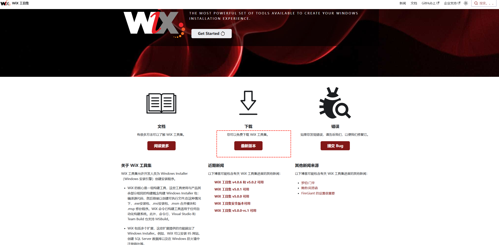

# jfx-maven-plugin

<p align="center">
  <a href="https://github.com/lxwise/jfx-maven-plugin/">
    
  </a>
</p>

<p align="center">
jfx-maven-plugin 是一个 JavaFX 打包插件，提供了一体化方案来解决基于 JavaFX 框架打包为独立桌面应用程序的难题。支持模块化和非模块化项目，一键打包全平台（Windows、macOS、Linux）可执行文件（app-image、exe、msi、rpm、deb、pkg、dmg）。
</p>

<p align="center">
   <a target="_blank" href="https://github.com/lxwise/jfx-maven-plugin">
      
      
      
      
   </a>
</p>

## 项目地址

**Gitee 地址：** [https://gitee.com/lxwise/jfx-maven-plugin](https://gitee.com/lxwise/jfx-maven-plugin)

**Github 地址：** [https://github.com/lxwise/jfx-maven-plugin](https://github.com/lxwise/jfx-maven-plugin)

## Star

ps: 虽然我知道，大部分人和作者菌一样喜欢白嫖，都是看了直接下载源代码后就潇洒的离开。但我还是想请各位喜欢本项目的小伙伴：**Star**，**Star**，**Star**。只有你们的**Star**本项目才能有更多的人看到，才有更多志同道合的小伙伴一起加入完善本项目。请小伙伴们动动您可爱的小手，给本项目一个**Star**。**同时也欢迎大家提交pr，一起改进项目** 。

## 重要说明

**打包为 .exe、.msi 安装程序文件需安装 [WiX 工具集](https://wixtoolset.org/)（`candle` 和 `light` 命令必须在 PATH 变量中）**



### 开始使用 WiX

有三种使用 WiX 的方法：

- [命令行 .NET 工具](https://wixtoolset.org/docs/intro/#nettool)
- [命令行和 CI/CD 生成系统上的 MSBuild](https://wixtoolset.org/docs/intro/#msbuild)
- [Visual Studio](https://wixtoolset.org/docs/intro/#vs)

### 命令行 .NET 工具

WiX 可作为 [.NET 工具](https://learn.microsoft.com/en-us/dotnet/core/tools/global-tools)使用，供您在命令行中使用。

> 注意：`wix.exe` 工具需要 .NET SDK 版本 6 或更高版本。

Wix.exe 支持执行特定操作的命令。例如，`build` 命令允许您构建 MSI 包、捆绑包和其他包类型。

安装 Wix.exe .NET 工具：

```sh
dotnet tool install --global wix
```

验证 Wix.exe 是否已成功安装：

```sh
wix --version
```

### 更新 WiX .NET 工具

```sh
dotnet tool update --global wix
```

另请参阅：[Wix.exe 命令行参考](https://wixtoolset.org/docs/tools/wixexe/)

---

## 安装和使用

### 1. 依赖安装

在 `pom.xml` 中添加插件配置：

```xml
<build>
    <plugins>
        <plugin>
            <groupId>io.github.lxwise</groupId>
            <artifactId>jfx-maven-plugin</artifactId>
            <version>1.0.1</version>
            <configuration>
                <mainClass>com.example.MainApp</mainClass>
            </configuration>
        </plugin>
    </plugins>
</build>
```

### 2. 执行打包

```shell
mvn clean jfx:package
```

### 3. 打包模式

插件支持两种打包模式：

| 模式 | 触发条件 | 说明 |
|------|---------|------|
| **普通模式（非模块化）** | `imagePath` 未设置 | 自动复制所有运行时依赖，由 jpackage 构建完整安装包 |
| **Runtime-image 模式（模块化）** | `imagePath` 已设置 | 使用预构建的运行时镜像打包，`options` 和 `arguments` 参数不生效 |

### 4. 示例

#### 4.1 模块化打包

```xml
<build>
    <plugins>
        <plugin>
            <groupId>org.openjfx</groupId>
            <artifactId>javafx-maven-plugin</artifactId>
            <version>0.0.8</version>
            <configuration>
                <mainClass>com.lxwise.plugin.AppStart</mainClass>
            </configuration>
        </plugin>
        <plugin>
            <groupId>io.github.lxwise</groupId>
            <artifactId>jfx-maven-plugin</artifactId>
            <version>1.0.0</version>
            <configuration>
                <imagePath>${project.build.directory}/image</imagePath>
                <name>jfx-test</name>
                <mainClass>com.lxwise.plugin.AppStart</mainClass>
            </configuration>
        </plugin>
    </plugins>
</build>
```

#### 4.2 非模块化打包

```xml
<build>
    <plugins>
        <plugin>
            <groupId>io.github.lxwise</groupId>
            <artifactId>jfx-maven-plugin</artifactId>
            <version>1.0.0</version>
            <configuration>
                <name>jfx-test</name>
                <mainClass>com.lxwise.plugin.AppStart</mainClass>
                <version>1.0.0</version>
                <vendor>lxwise</vendor>
                <copyright>版权@lxwise</copyright>
                <description>jfx-test的测试描述信息</description>
                <aboutUrl>https://github.com/lxwise/jfx-maven-plugin</aboutUrl>

                <!-- Windows 配置 -->
                <winDirChooser>true</winDirChooser>
                <winMenu>true</winMenu>
                <winShortcut>true</winShortcut>
                <winPerUserInstall>true</winPerUserInstall>
                <winShortcutPrompt>true</winShortcutPrompt>

                <!-- macOS 配置 -->
                <macPackageIdentifier>jfx-test</macPackageIdentifier>

                <!-- Linux 配置 -->
                <linuxMenuGroup>System</linuxMenuGroup>
                <linuxPackageName>jfx-test</linuxPackageName>
                <linuxShortcut>true</linuxShortcut>

                <!-- JVM 选项 -->
                <options>
                    <option>-Xms128m</option>
                    <option>-Xmx1024m</option>
                </options>

                <!-- 应用参数 -->
                <arguments>
                    <argument>jfx-maven-plugin</argument>
                    <argument>V1.0.0</argument>
                </arguments>
            </configuration>
        </plugin>
    </plugins>
</build>
```

#### 4.3 完整配置示例

```xml
<plugin>
    <groupId>io.github.lxwise</groupId>
    <artifactId>jfx-maven-plugin</artifactId>
    <version>1.0.0</version>
    <configuration>
        <!-- ===== 核心配置（必填） ===== -->
        <mainClass>com.example.MainApp</mainClass>

        <!-- ===== 通用配置 ===== -->
        <name>MyApp</name>
        <vendor>My Company</vendor>
        <type>exe</type>
        <version>2.0.0</version>
        <icon>javafx/windows/app.ico</icon>
        <description>我的 JavaFX 应用</description>
        <copyright>Copyright 2024 My Company</copyright>
        <verbose>true</verbose>
        <aboutUrl>https://example.com</aboutUrl>
        <installDir>C:\Program Files\MyApp</installDir>

        <!-- ===== JVM 选项 ===== -->
        <options>
            <option>-Xmx512m</option>
            <option>-Dfile.encoding=UTF-8</option>
        </options>

        <!-- ===== 应用参数 ===== -->
        <arguments>
            <argument>--debug</argument>
        </arguments>

        <!-- ===== Windows 特定配置 ===== -->
        <winMenu>true</winMenu>
        <winShortcut>true</winShortcut>
        <winDirChooser>true</winDirChooser>
        <winMenuGroup>MyCompany</winMenuGroup>
        <winPerUserInstall>false</winPerUserInstall>
        <winShortcutPrompt>true</winShortcutPrompt>
        <winHelpUrl>https://example.com/help</winHelpUrl>
        <winUpdateUrl>https://example.com/update</winUpdateUrl>
        <winUpgradeUuid>12345678-1234-1234-1234-123456789012</winUpgradeUuid>
        <winConsole>false</winConsole>

        <!-- ===== macOS 特定配置 ===== -->
        <macPackageIdentifier>com.example.myapp</macPackageIdentifier>
        <macPackageName>MyApp</macPackageName>
        <macAppCategory>public.app-category.developer-tools</macAppCategory>
        <macAppStore>false</macAppStore>
        <macEntitlements>javafx/mac/MyApp.entitlements</macEntitlements>

        <!-- ===== Linux 特定配置 ===== -->
        <linuxPackageName>myapp</linuxPackageName>
        <linuxDebMaintainer>admin@example.com</linuxDebMaintainer>
        <linuxMenuGroup>Development</linuxMenuGroup>
        <linuxShortcut>true</linuxShortcut>

        <!-- ===== Runtime-image 模式（与普通模式二选一） ===== -->
        <!-- <imagePath>target/runtime-image</imagePath> -->
    </configuration>
</plugin>
```

---

## 参数说明

> 使用方法基本是对 [官方说明文档](https://docs.oracle.com/en/java/javase/21/docs/specs/man/jpackage.html)的翻译

### 核心参数

| 参数 | 类型 | 必填 | 默认值 | 对应 jpackage 选项 | 说明 |
|------|------|------|--------|-------------------|------|
| `mainClass` | `String` | **是** | — | `--main-class` / `--module` | 应用程序入口类全限定名 |
| `imagePath` | `String` | 否 | — | `--runtime-image` | 预构建的运行时镜像路径，指定后启用模块化打包模式 |
| `options` | `List<String>` | 否 | — | `--java-options` | 传递给 JVM 的选项列表（仅普通模式生效） |
| `arguments` | `List<String>` | 否 | — | `--arguments` | 传递给主类的命令行参数列表（仅普通模式生效） |

**options 配置示例：**

```xml
<options>
    <option>-Xms128m</option>
    <option>-Xmx1024m</option>
</options>
```

**arguments 配置示例：**

```xml
<arguments>
    <argument>jfx-maven-plugin</argument>
    <argument>V1.0.0</argument>
</arguments>
```

### 通用选项

| 参数 | 类型 | 默认值 | 对应 jpackage 选项 | 说明 |
|------|------|--------|-------------------|------|
| `name` | `String` | `${project.name}` | `--name` | 应用程序和/或包的名称 |
| `type` | `String` | 平台默认 | `--type` | 包类型：`app-image`、`exe`、`msi`、`rpm`、`deb`、`pkg`、`dmg`。未指定时创建平台默认类型 |
| `version` | `String` | `${project.version}` | `--app-version` | 应用版本号（建议使用三段式版本如 `1.0.1`） |
| `description` | `String` | — | `--description` | 应用程序描述 |
| `icon` | `String` | — | `--icon` | 图标路径（绝对路径或相对于 `${project.basedir}`），路径无效时输出警告 |
| `vendor` | `String` | — | `--vendor` | 应用程序供应商/作者 |
| `copyright` | `String` | — | `--copyright` | 版权信息 |
| `verbose` | `Boolean` | `false` | `--verbose` | 启用详细输出 |
| `aboutUrl` | `String` | — | `--about-url` | 应用程序主页 URL |
| `installDir` | `String` | — | `--install-dir` | 安装目录的绝对路径（macOS/Linux），或相对子路径如 "Program Files"（Windows） |

### Windows 平台打包参数

> 仅在 Windows 上运行时可用。

| 参数 | 类型 | 默认值 | 对应 jpackage 选项 | 说明 |
|------|------|--------|-------------------|------|
| `winConsole` | `Boolean` | `false` | `--win-console` | 创建控制台启动器，适用于需要控制台交互的应用 |
| `winDirChooser` | `Boolean` | `false` | `--win-dir-chooser` | 安装时添加目录选择对话框 |
| `winHelpUrl` | `String` | — | `--win-help-url` | 用户获取技术支持的 URL |
| `winMenu` | `Boolean` | `false` | `--win-menu` | 添加开始菜单快捷方式 |
| `winMenuGroup` | `String` | — | `--win-menu-group` | 开始菜单分组名称 |
| `winPerUserInstall` | `Boolean` | `false` | `--win-per-user-install` | 按用户安装（非系统级） |
| `winShortcut` | `Boolean` | `false` | `--win-shortcut` | 创建桌面快捷方式 |
| `winShortcutPrompt` | `Boolean` | `false` | `--win-shortcut-prompt` | 安装时提示用户是否创建快捷方式 |
| `winUpdateUrl` | `String` | — | `--win-update-url` | 应用程序更新信息的 URL |
| `winUpgradeUuid` | `String` | — | `--win-upgrade-uuid` | 与此软件包升级关联的 UUID |

### macOS 平台打包参数

> 仅在 macOS 上运行时可用。

| 参数 | 类型 | 默认值 | 对应 jpackage 选项 | 说明 |
|------|------|--------|-------------------|------|
| `macPackageIdentifier` | `String` | — | `--mac-package-identifier` | 唯一标识 macOS 应用的标识符，默认为主类名称。仅允许字母数字(A-Z,a-z,0-9)、连字符(-)和句点(.) |
| `macPackageName` | `String` | — | `--mac-package-name` | 菜单栏中显示的应用名称，长度必须少于 16 个字符，默认为应用名称 |
| `macPackageSigningPrefix` | `String` | — | `--mac-package-signing-prefix` | 签名时作为无包标识符组件的前缀 |
| `macSign` | `String` | — | `--mac-sign` | 请求对包或预定义的应用程序映像进行签名 |
| `macSigningKeychain` | `String` | — | `--mac-signing-keychain` | 用于搜索签名身份的密钥链名称，未指定则使用标准密钥链 |
| `macSigningKeyUserName` | `String` | — | `--mac-signing-key-user-name` | Apple 签名身份中的团队或用户名部分 |
| `macAppStore` | `Boolean` | `false` | `--mac-app-store` | 输出适用于 Mac App Store 的包 |
| `macEntitlements` | `String` | — | `--mac-entitlements` | 签名时使用的权利文件路径（.entitlements），路径无效时输出警告 |
| `macAppCategory` | `String` | — | `--mac-app-category` | 应用类别，用于构造 LSApplicationCategoryType，默认值为 "utilities" |

### Linux 平台打包参数

> 仅在 Linux 上运行时可用。

| 参数 | 类型 | 默认值 | 对应 jpackage 选项 | 说明 |
|------|------|--------|-------------------|------|
| `linuxPackageName` | `String` | — | `--linux-package-name` | Linux 软件包名称，默认为应用名称 |
| `linuxDebMaintainer` | `String` | — | `--linux-deb-maintainer` | .deb 包的维护者邮箱地址 |
| `linuxMenuGroup` | `String` | — | `--linux-menu-group` | 应用所在的菜单组名称 |
| `linuxShortcut` | `Boolean` | `false` | `--linux-shortcut` | 为应用创建桌面快捷方式 |

---

## 执行流程

插件执行 `jfx:package` 目标时，按以下步骤运行：

1. **清理**：删除 `target/javafx/` 旧目录及全部内容
2. **创建工作目录**：在 `target/` 下创建 `javafx/` 目录
3. **初始化资源目录**：检查项目根目录下 `javafx/{windows|mac|linux}/` 是否存在，作为 `--resource-dir`
4. **复制依赖**（仅普通模式）：收集所有运行时依赖 JAR 和主 JAR 到 `target/javafx/lib/`
5. **构建命令**：根据配置参数组装完整的 `jpackage` 命令行
6. **执行打包**：调用 `jpackage` 命令完成打包

---

## 资源目录

通过向资源目录添加替换资源，可以覆盖 jpackage 的图标、模板文件和其他资源。插件自动读取 `${project.basedir}/javafx/` 下对应平台的子目录，无需额外配置，目录存在即可。

**目录结构：**

```
project-root/
├── javafx/
│   ├── windows/     ← Windows 平台资源（如自定义图标、WiX 配置等）
│   ├── mac/         ← macOS 平台资源（如 .entitlements 文件等）
│   └── linux/       ← Linux 平台资源
├── src/
├── target/
│   └── javafx/      ← 构建输出目录（自动生成）
│       ├── lib/     ← 依赖库目录（自动生成）
│       └── *.exe    ← 打包产物
└── pom.xml
```

### Linux 资源目录文件

**通用文件：**

| 文件名 | 说明 | 默认资源 |
|--------|------|---------|
| `{launcher-name}.png` | 应用启动器图标 | `JavaApp.png` |
| `{launcher-name}.desktop` | 桌面文件，用于文件关联和图标显示 | `template.desktop` |

**DEB/RPM 安装程序：**

| 文件名 | 说明 | 默认资源 |
|--------|------|---------|
| `{package-name}-{launcher-name}.service` | systemd 单元文件（后台服务应用） | `unit-template.service` |

**RPM 安装程序：**

| 文件名 | 说明 | 默认资源 |
|--------|------|---------|
| `{package-name}.spec` | RPM 规范文件 | `template.spec` |

**DEB 安装程序：**

| 文件名 | 说明 | 默认资源 |
|--------|------|---------|
| `control` | 控制文件 | `template.control` |
| `copyright` | 版权文件 | `template.copyright` |
| `preinstall` | 预安装 shell 脚本 | `template.preinstall` |
| `prerm` | 预删除 shell 脚本 | `template.prerm` |
| `postinstall` | 后安装 shell 脚本 | `template.postinstall` |
| `postrm` | 后删除 shell 脚本 | `template.postrm` |

### Windows 资源目录文件

**通用文件：**

| 文件名 | 说明 | 默认资源 |
|--------|------|---------|
| `{launcher-name}.ico` | 应用启动器图标 | `JavaApp.ico` |
| `{launcher-name}.properties` | 启动器可执行文件属性 | `WinLauncher.template` |

**MSI/EXE 安装程序：**

| 文件名 | 说明 | 默认资源 |
|--------|------|---------|
| `<application-name>-post-image.wsf` | 构建应用镜像后运行的 WSF 脚本 | — |
| `main.wxs` | 主 WiX 项目文件 | `main.wxs` |
| `overrides.wxi` | 覆盖 WiX 项目文件 | `overrides.wxi` |
| `service-installer.exe` | 服务安装程序（后台服务应用） | — |
| `{launcher-name}-service-install.wxi` | 服务安装 WiX 文件（后台服务应用） | `service-install.wxi` |
| `{launcher-name}-service-config.wxi` | 服务配置 WiX 文件（后台服务应用） | `service-config.wxi` |
| `InstallDirNotEmptyDlg.wxs` | 安装目录检查对话框 | `InstallDirNotEmptyDlg.wxs` |
| `ShortcutPromptDlg.wxs` | 快捷方式配置对话框 | `ShortcutPromptDlg.wxs` |
| `bundle.wxf` | 应用镜像组件层次结构文件 | — |
| `ui.wxf` | 安装程序 UI 文件 | — |
| `{package-name}-post-msi.wsf` | 构建 MSI 后运行的 WSF 脚本（EXE 安装程序） | — |

**EXE 安装程序：**

| 文件名 | 说明 | 默认资源 |
|--------|------|---------|
| `WinInstaller.properties` | 安装程序可执行文件属性 | `WinInstaller.template` |

### macOS 资源目录文件

**通用文件：**

| 文件名 | 说明 | 默认资源 |
|--------|------|---------|
| `{launcher-name}.icns` | 应用启动器图标 | `JavaApp.icns` |
| `Info.plist` | 应用属性列表文件 | `Info-lite.plist.template` |
| `Runtime-Info.plist` | Java 运行时属性列表文件 | `Runtime-Info.plist.template` |
| `<application-name>.entitlements` | 签名授权属性列表文件 | `sandbox.plist` |

**PKG/DMG 安装程序：**

| 文件名 | 说明 | 默认资源 |
|--------|------|---------|
| `{package-name}-post-image.sh` | 构建应用镜像后运行的 shell 脚本 | — |

**PKG 安装程序：**

| 文件名 | 说明 | 默认资源 |
|--------|------|---------|
| `uninstaller` | 卸载程序 shell 脚本 | `uninstall.command.template` |
| `preinstall` | 预安装 shell 脚本 | `preinstall.template` |
| `postinstall` | 后安装 shell 脚本 | `postinstall.template` |
| `services-preinstall` | 服务包预安装脚本（后台服务应用） | `services-preinstall.template` |
| `services-postinstall` | 服务包后安装脚本（后台服务应用） | `services-postinstall.template` |
| `{package-name}-background.png` | 背景图片 | `background_pkg.png` |
| `{package-name}-background-darkAqua.png` | 深色背景图片 | `background_pkg.png` |
| `product-def.plist` | 包属性列表文件 | `product-def.plist` |
| `{package-name}-{launcher-name}.plist` | launchd 属性列表文件（后台服务应用） | `launchd.plist.template` |

**DMG 安装程序：**

| 文件名 | 说明 | 默认资源 |
|--------|------|---------|
| `{package-name}-dmg-setup.scpt` | 设置 AppleScript 脚本 | `DMGsetup.scpt` |
| `{package-name}-license.plist` | 许可属性列表文件 | `lic_template.plist` |
| `{package-name}-background.tiff` | 背景图片 | `background_dmg.tiff` |
| `{package-name}-volume.icns` | 卷图标 | `JavaApp.icns` |

---

## 最后

最后，我希望我的项目能够为你带来帮助与收获。如果你有任何建议或意见，欢迎随时联系我。让我们一起分享知识，共同成长！
